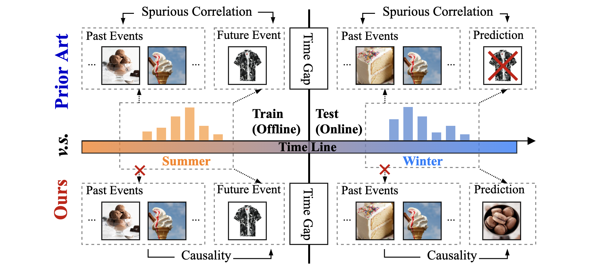

## Towards Out-of-Distribution Sequential Event Prediction: A Causal Treatment

The official implementation for "Towards Out-of-Distribution Sequential Event Prediction: A Causal Treatment" which is accepted to NeurIPS22. 

**Abstract:** The goal of sequential event prediction is to estimate the next event based on a sequence of historical events, with applications to sequential recommendation, user behavior analysis and clinical treatment. In practice, the next-event prediction models are trained with sequential data collected at one time and need to generalize to newly arrived sequences in remote future, which requires models to handle temporal distribution shift from training to testing. In this paper, we first take a data-generating perspective to reveal a negative result that existing approaches with maximum likelihood estimation would fail for distribution shift due to the latent context confounder, i.e., the common cause for the historical events and the next event. Then we devise a new learning objective based on backdoor adjustment and further harness variational inference to make it tractable for sequence learning problems. On top of that, we propose a framework with hierarchical branching structures for learning context-specific representations. Comprehensive experiments on diverse tasks (e.g., sequential recommendation) demonstrate the effectiveness, applicability and scalability of our method with various off-the-shelf models as backbones. 

Related materials: 
[paper](https://openreview.net/pdf?id=XQu7UFSbzd2)



### How to Run?

- Install the required package according to `requirements.txt`.
- Download publicly accessible datasets and specify your own data path in `utils.py`. The dataset should be a text file, where each line is a 'sequence_id event_id' or 'user_id item_id' pair. These pairs are sorted in chronological order.
- Train the model, logs will be saved in the folder `results`. E.g.
```
python main.py --dataset=ml-1m --backbone=gru --device=cuda:0
```

### Citation
If you find our codes useful, please consider citing our work
```bibtex
      @inproceedings{yang2022caseq,
      title = {Towards Out-of-Distribution Sequential Event Prediction: A Causal Treatment},
      author = {Chenxiao Yang and Qitian Wu and Qingsong Wen and Zhiqiang Zhou and Liang Sun and Junchi Yan},
      booktitle = {Advances in Neural Information Processing Systems (NeurIPS)},
      year = {2022}
      }
```